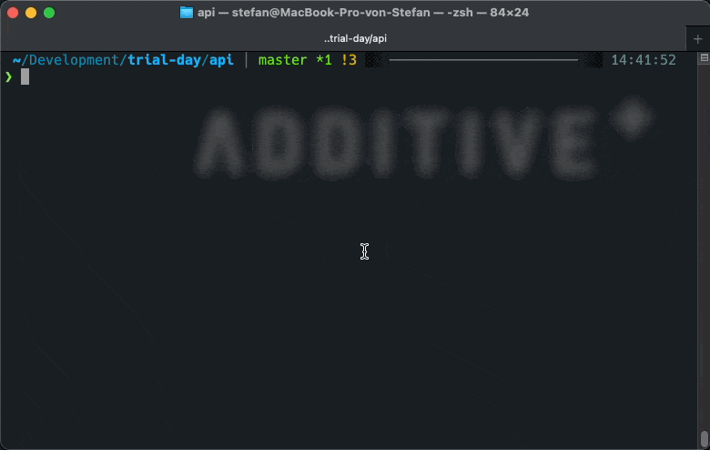

<p align="center"><a href="https://additive.eu" target="_blank"></a></p>


# 03 Quiz App 

## Introduction

This repository includes a simple quiz cli application. With following commands:

### Answer questions
```php
php artisan quiz
```

### List all answers
```php
php artisan answers
```


## Challenges

1. This quiz has some bugs. Your challenge is to fix all bugs, so the expected result is:



2. Change the text `Who is the most fascinating person you’ve meet` to `Who is the most fascinating person you’ve met`

3. Make a Pull Request including your changes of 1. + 2. and describe some edge cases of this code.
