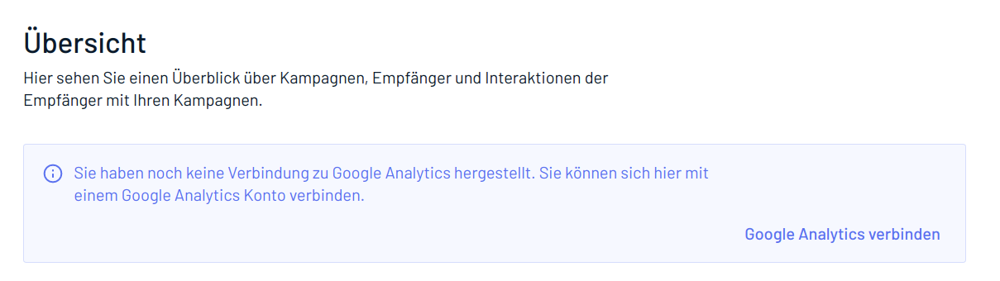

# 04 Research

At ADDITIVE we need the possibility for our content creators to update the texts used in our ADDITIVE+APPS in all supported languages. The elaborated solution should neither require our content creators to have access to the codebase hosted on GitHub nor require a redeploy of an app after a text change. All apps are already multilingual and use keys to get a text in a specific language.

Your goal is to find and discuss at least two solutions inside this document that can be implemented in our Frontend (JS) and Backend (PHP) with it's pros and cons. Create a pull request at the end to complete your work. 

Currently this languages should be supported 

- en
- de
- it
- fr
- nl
- pl

### Example

In the example above you can see 4 text elements taken from ADDITIVE+NEWSLETTER that should be adjustable and translatable.

- Übersicht (key = `newsletter.overview.title`)
- Hier sehen Sie einen Überblick über Kampagnen, Empfänger und Interaktionen der Empfänger mit Ihren Kampagnen. (key = `newsletter.overview.intro`)
- Sie haben noch keine Verbindung zu Google Analytics hergestellt. Sie können sich hier mit einem Google Analytics Konto verbinden. (key = `newsletter.notification.google_analytics.missing.text`)
- Google Analytics verbinden (key = `newsletter.notification.google_analytics.missing.action`)
